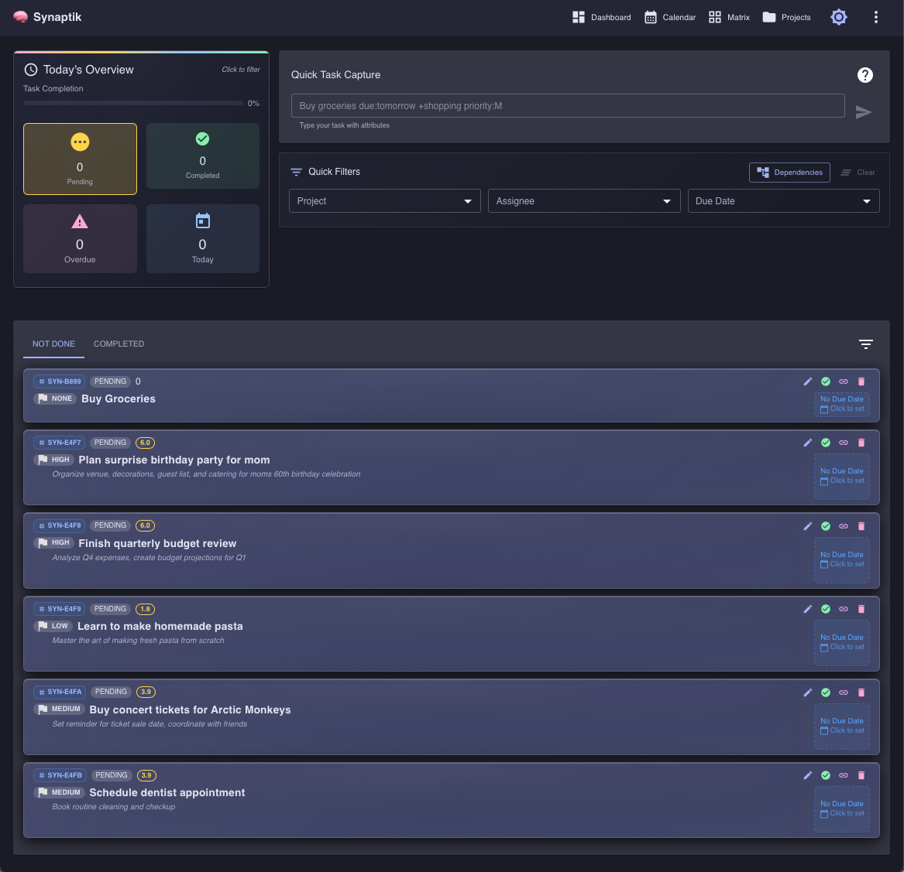

<div align="center">

# 🧠 Synaptik

[](https://github.com/dukeroyahl/synaptik/actions/workflows/ci.yml)
[](https://github.com/dukeroyahl/synaptik/actions/workflows/cd.yml)
[](https://openjdk.java.net/)
[](https://quarkus.io/)
[](https://reactjs.org/)
[](https://opensource.org/licenses/MIT)

[](https://github.com/dukeroyahl/synaptik/pkgs/container/synaptik)
[](https://github.com/dukeroyahl/synaptik/pkgs/container/synaptik/versions?filters%5Bversion_type%5D=tagged&query=frontend)
[](https://github.com/dukeroyahl/synaptik/pkgs/container/synaptik/versions?filters%5Bversion_type%5D=tagged&query=backend)
[](https://github.com/dukeroyahl/synaptik/releases/latest)
[](https://github.com/dukeroyahl/synaptik/releases/latest)

[🚀 Quick Start](#-quick-start) • [📚 Wiki Documentation](https://github.com/dukeroyahl/synaptik/wiki) • [🤝 Contributing](CONTRIBUTING.md) • [📝 Conventional Commits](https://github.com/dukeroyahl/synaptik/wiki/Conventional-Commits)

</div>

---

## 🎯 What is Synaptik?

**Synaptik** is where ideas connect—a next-generation task management application that combines TaskWarrior's powerful DNA with modern web technologies and AI integration. Built for productivity enthusiasts who need more than simple to-do lists, Synaptik offers natural language task capture, intelligent analytics, and seamless integration with AI assistants like Claude.

**Key Features:**
- 🧠 **TaskWarrior DNA**: Natural language task capture and powerful task management
- ⚡ **Modern Stack**: Java 21 + Quarkus + React 18 for blazing-fast performance
- 🤖 **AI-First**: Native Claude integration via Model Context Protocol (MCP)
- 📊 **Smart Analytics**: Productivity insights and intelligent dashboards
- 🐳 **Container-Ready**: Multi-architecture Docker images with semantic versioning



---

## 📦 GitHub Packages

<div align="center">

### 🐳 Docker Images (GitHub Container Registry)
[](https://github.com/dukeroyahl/synaptik/pkgs/container/synaptik/versions?filters%5Bversion_type%5D=tagged&query=frontend)
[](https://github.com/dukeroyahl/synaptik/pkgs/container/synaptik/versions?filters%5Bversion_type%5D=tagged&query=backend)

```bash
# Pull latest images
docker pull ghcr.io/dukeroyahl/synaptik:frontend-latest
docker pull ghcr.io/dukeroyahl/synaptik:backend-latest
```

### 🔥 Native MCP Binaries (GitHub Releases)
[](https://github.com/dukeroyahl/synaptik/releases/latest)
[](https://github.com/dukeroyahl/synaptik/releases/latest)
[](https://github.com/dukeroyahl/synaptik/releases/latest)

```bash
# Download for macOS Apple Silicon (Primary Platform)
curl -sSL https://github.com/dukeroyahl/synaptik/releases/latest/download/synaptik-mcp-darwin-arm64 -o synaptik-mcp
chmod +x synaptik-mcp
```

</div>

---

## 🚀 Quick Start

Get Synaptik running in under 2 minutes with Docker:

### Prerequisites
- **Docker Desktop** - [Download here](https://www.docker.com/products/docker-desktop/)

### Installation Options

**Option 1: One-Click Install (Recommended)**
```bash
curl -sSL https://raw.githubusercontent.com/dukeroyahl/synaptik/main/install.sh | bash
```

**Option 2: Docker Compose (Production-Ready)**
```bash
# Create dedicated folder, download configuration files and start
mkdir synaptik && cd synaptik && \
curl -sSL https://raw.githubusercontent.com/dukeroyahl/synaptik/main/docker/docker-compose.yml -o docker-compose.yml && \
curl -sSL https://raw.githubusercontent.com/dukeroyahl/synaptik/main/docker/.env.example -o .env && \
docker-compose up -d
```

### 🌐 Access Your Application
- **Web App**: http://localhost:4000
- **API**: http://localhost:9001
- **API Documentation**: http://localhost:9001/q/swagger-ui


---

## 🤖 Claude Desktop Integration

Enhance your productivity by connecting Synaptik with Claude Desktop. Once configured, you can ask Claude to manage your tasks directly!

### Setup Instructions

#### Step 1: Install Synaptik
```bash
# Quick install - sets up the full application
curl -sSL https://raw.githubusercontent.com/dukeroyahl/synaptik/main/install.sh | bash
```

This installs the complete Synaptik application with:
- **Web Interface**: http://localhost:4000
- **REST API**: http://localhost:9001  
- **API Documentation**: http://localhost:9001/q/swagger-ui
- **Docker Services**: Complete containerized backend

#### Step 2: Download MCP Connector (Native Binary)
```bash
# Download the native binary for your platform
curl -sSL https://github.com/dukeroyahl/synaptik/releases/latest/download/synaptik-mcp-darwin-arm64 -o synaptik-mcp
chmod +x synaptik-mcp
```

**Available Platforms:**
- **macOS Apple Silicon**: `synaptik-mcp-darwin-arm64` ⭐ **(Primary Platform)**
- **Linux x86_64**: `synaptik-mcp-linux-amd64`
- **Linux ARM64**: `synaptik-mcp-linux-arm64`

> **Architecture**: The MCP server is a standalone native executable that connects to your Dockerized Synaptik server on port 9001. No dependencies required!

#### Step 3: Configure Claude Desktop
Add this to your Claude Desktop configuration:

**Configuration File Locations:**
- **macOS**: `~/Library/Application Support/Claude/claude_desktop_config.json`
- **Windows**: `%APPDATA%/Claude/claude_desktop_config.json`
- **Linux**: `~/.config/Claude/claude_desktop_config.json`

```json
{
  "mcpServers": {
    "synaptik": {
      "command": "/path/to/synaptik-mcp"
    }
  }
}
```

> **How it works**: The native MCP binary runs in stdio mode and communicates with Claude Desktop directly, while making HTTP calls to your Dockerized Synaptik server on port 9001.

**Example paths:**
- **Linux**: `"/home/user/synaptik-mcp"`
- **macOS**: `"/Users/user/synaptik-mcp"`

#### Step 4: Ensure Synaptik is Running
Make sure your Synaptik Docker services are running:
```bash
# Check if Synaptik is running
curl http://localhost:9001/health || echo "Start Synaptik first!"
```

#### Step 5: Restart Claude Desktop
Restart Claude Desktop and you're ready to go!

### Available Claude Commands
- **Task Management**: Create, update, complete, and delete tasks
- **Smart Queries**: Get tasks by status, project, tags, or priority
- **Data Import**: Import tasks from external sources
- **Analytics**: Retrieve productivity insights and statistics

---

## 📖 Documentation

### 👥 For Users
- **[📚 Complete Wiki](https://github.com/dukeroyahl/synaptik/wiki)** - Comprehensive documentation hub
- **[User Guide](https://github.com/dukeroyahl/synaptik/wiki/User-Guide)** - Complete user documentation
- **[MCP Integration Guide](https://github.com/dukeroyahl/synaptik/wiki/MCP-Server)** - Claude Desktop setup

### 💻 For Developers  
- **[Developer Guide](https://github.com/dukeroyahl/synaptik/wiki/Developer-Guide)** - Technical documentation
- **[Contributing Guidelines](CONTRIBUTING.md)** - How to contribute
- **[Branching Strategy](docs/BRANCHING_STRATEGY.md)** - Automated versioning and branch conventions
- **[Docker Guide](https://github.com/dukeroyahl/synaptik/wiki/Docker-Guide)** - Container deployment

---

<div align="center">

**Built with ❤️ by the Synaptik team**

[🚀 Quick Start](#-quick-start) • [📚 Wiki Documentation](https://github.com/dukeroyahl/synaptik/wiki) • [🤝 Contributing](CONTRIBUTING.md) • [📝 Issues](https://github.com/dukeroyahl/synaptik/issues)

</div>